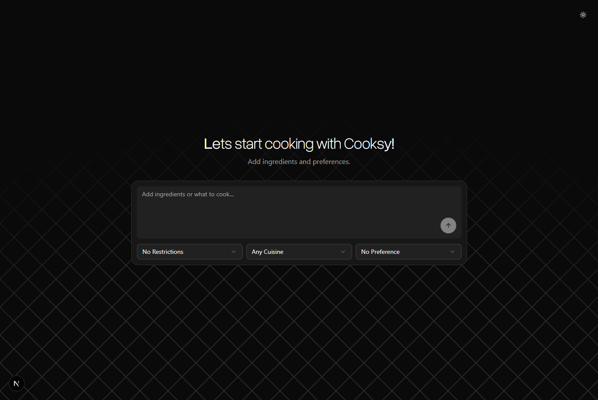

# COOKSY 

COOKSY is a full-stack project with a Python backend and a NEXT JS frontend app.  
This guide helps you get it running on your local machine quickly.

## Live demo

Currently live at -  [cooksy.curr.xyz](https://cooksy.curr.xyz)

## Preview



## Features

- Generate recipes from ingredients you already have
- Set cuisine and dietary preferences before generating
- View a dedicated recipe result page after generation
- Clean, responsive UI with light and dark theme support
- Uses the openrouter/free api for backend 

## Local setup

### 1) Clone the project

```bash
git clone <your-repo-url>
cd chef-ai
```

### 2) Setup and run backend

```bash
cd backend

# Create and activate virtual environment
python3 -m venv venv
source venv/bin/activate

# Install dependencies
pip install -r requirements.txt

# Create local env file
cp .env.example .env

# Start backend server
python main.py
```

### 3) Setup and run frontend (in a new terminal)

```bash
cd frontend
npm install

# Create local env file if needed
cp .env.example .env

# Start frontend app
npm run dev
```

### 4) Open the app

- Frontend: `http://localhost:3000`
- Backend: check backend terminal logs for host/port

